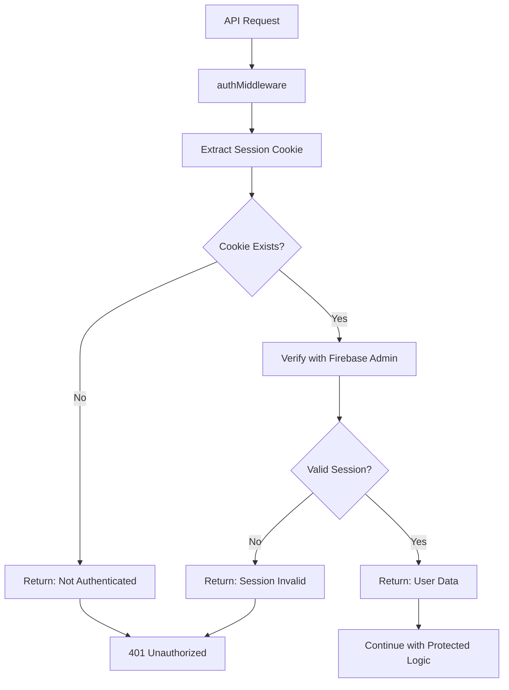

# Authentication Middleware

Documentation for the authentication middleware system used throughout the NextAI GF application.

## Overview

The authentication middleware (`authMiddleware`) provides a centralized way to verify user authentication across protected API endpoints. It validates session cookies and returns user information for authenticated requests.

## 🔧 Middleware Architecture

### Location
The `authMiddleware` is imported from:
```javascript
import { authMiddleware } from "@/app/middleware/authMiddleware";
```

### Basic Usage Pattern

```javascript
export async function protectedHandler(req) {
  try {
    const authResult = await authMiddleware(req);
    
    if (!authResult.authenticated) {
      return NextResponse.json({ error: authResult.error }, { status: 401 });
    }
    
    const userId = authResult.user.uid;
    // Protected operation logic here...
    
  } catch (error) {
    return NextResponse.json({ error: error.message }, { status: 400 });
  }
}
```

## 📝 Middleware Response Structure

### Successful Authentication

```javascript
{
  authenticated: true,
  user: {
    uid: "firebase-user-id",
    email: "user@example.com",
    // Additional Firebase user properties
  }
}
```

### Failed Authentication

```javascript
{
  authenticated: false,
  error: "Session expired" // or other error message
}
```

## 🛡️ Authentication Flow



## 🔒 Protected Endpoints

The following authentication endpoints use `authMiddleware`:

### `/auth/verify` - Authentication Check
**Purpose**: Verify current authentication status  
**Implementation**:
```javascript
const authResult = await authMiddleware(req);
if (!authResult.authenticated) {
  return NextResponse.json({
    isAuthenticated: false,
    message: 'User not authenticated'
  }, { status: 401 });
}
```

### `/auth/edit-user` - Profile Editing
**Purpose**: Update user profile information  
**Implementation**:
```javascript
const authResult = await authMiddleware(req);
if (!authResult.authenticated) {
  return NextResponse.json({ error: authResult.error }, { status: 401 });
}

const userId = authResult.user.uid;
// Update user profile...
```

### `/auth/delete` - Account Deletion
**Purpose**: Delete user account permanently  
**Implementation**:
```javascript
const authResult = await authMiddleware(req);
if (!authResult.authenticated) {
  return NextResponse.json({ error: authResult.error }, { status: 401 });
}

const id = authResult.user.uid;
// Delete user account...
```

## 🍪 Cookie Handling

### Session Cookie Configuration

The middleware expects a session cookie named `tokenAIGF` with the following properties:

```javascript
{
  name: 'tokenAIGF',
  httpOnly: true,
  sameSite: 'lax',
  secure: process.env.NODE_ENV === 'production',
  maxAge: 48 * 60 * 60 // 48 hours
}
```

### Cookie Extraction Process

1. **Request Processing**: Middleware extracts cookies from the request
2. **Token Validation**: Validates the `tokenAIGF` session cookie
3. **Firebase Verification**: Uses Firebase Admin SDK to verify session
4. **User Data Retrieval**: Returns authenticated user information

## ⚡ Implementation Examples

### Basic Protection

```javascript
import { authMiddleware } from "@/app/middleware/authMiddleware";
import { NextResponse } from "next/server";

export async function GET(req) {
  const authResult = await authMiddleware(req);
  
  if (!authResult.authenticated) {
    return NextResponse.json({ error: authResult.error }, { status: 401 });
  }
  
  // Protected logic here
  return NextResponse.json({ message: "Access granted", user: authResult.user });
}
```

### User-specific Operations

```javascript
export async function POST(req) {
  const authResult = await authMiddleware(req);
  
  if (!authResult.authenticated) {
    return NextResponse.json({ error: authResult.error }, { status: 401 });
  }
  
  const userId = authResult.user.uid;
  const userEmail = authResult.user.email;
  
  // Use userId and userEmail for user-specific operations
  const userData = await getUserData(userId);
  
  return NextResponse.json({ data: userData });
}
```

### Error Handling Pattern

```javascript
export async function protectedEndpoint(req) {
  try {
    const authResult = await authMiddleware(req);
    
    if (!authResult.authenticated) {
      return NextResponse.json({ 
        error: authResult.error || "Authentication required" 
      }, { status: 401 });
    }
    
    // Protected operations...
    
  } catch (error) {
    console.error('Endpoint error:', error);
    return NextResponse.json({ 
      error: "Internal server error" 
    }, { status: 500 });
  }
}
```

## 🔍 Error Scenarios

### Common Error Cases

1. **No Session Cookie**
   ```javascript
   {
     authenticated: false,
     error: "No session cookie found"
   }
   ```

2. **Invalid Session Cookie**
   ```javascript
   {
     authenticated: false,
     error: "Invalid session cookie"
   }
   ```

3. **Expired Session**
   ```javascript
   {
     authenticated: false,
     error: "Session expired"
   }
   ```

4. **Firebase Verification Failed**
   ```javascript
   {
     authenticated: false,
     error: "Authentication verification failed"
   }
   ```

### Handling Errors in Protected Routes

```javascript
const authResult = await authMiddleware(req);

if (!authResult.authenticated) {
  // Log the specific error for debugging
  console.log('Auth failed:', authResult.error);
  
  // Return generic error to client for security
  return NextResponse.json({ 
    error: "Authentication required" 
  }, { status: 401 });
}
```

## 🚀 Performance Considerations

### Session Validation

- **Firebase Admin SDK**: Uses efficient session validation
- **Minimal Database Calls**: Only validates session, doesn't fetch full user data
- **Error Caching**: Failed authentications return quickly

### Best Practices

1. **Early Returns**: Check authentication before expensive operations
2. **Error Logging**: Log authentication failures for monitoring
3. **Consistent Responses**: Use standardized error responses
4. **Avoid Redundancy**: Don't call middleware multiple times per request

## 🔗 Integration with Other Systems

### Database Operations

After successful authentication:
```javascript
const authResult = await authMiddleware(req);
if (authResult.authenticated) {
  const userRef = adminDb.firestore().collection('users').doc(authResult.user.uid);
  const userDoc = await userRef.get();
  // Use Firestore user data...
}
```

### Premium Feature Access

```javascript
const authResult = await authMiddleware(req);
if (authResult.authenticated) {
  const userDoc = await getUserDocument(authResult.user.uid);
  
  if (!userDoc.premium) {
    return NextResponse.json({ 
      error: "Premium subscription required" 
    }, { status: 403 });
  }
  
  // Premium feature logic...
}
```

## 🛠️ Debugging Authentication Issues

### Common Debugging Steps

1. **Check Cookie Presence**:
   ```javascript
   console.log('Request cookies:', req.cookies);
   ```

2. **Validate Environment Variables**:
   ```javascript
   console.log('Firebase config present:', !!process.env.FIREBASE_PROJECT_ID);
   ```

3. **Log Authentication Results**:
   ```javascript
   const authResult = await authMiddleware(req);
   console.log('Auth result:', authResult);
   ```

### Debug Checklist

- [ ] Session cookie is being set correctly during login
- [ ] Cookie is being sent with subsequent requests
- [ ] Firebase Admin SDK is properly configured
- [ ] Environment variables are set correctly
- [ ] Session hasn't expired (48-hour limit)

## 📊 Security Best Practices

### Input Validation

Always validate the authenticated user's data:
```javascript
const authResult = await authMiddleware(req);
if (authResult.authenticated && authResult.user.uid) {
  // Use the authenticated user ID
  const userId = authResult.user.uid;
} else {
  return NextResponse.json({ error: "Invalid user session" }, { status: 401 });
}
```

### Session Security

- **Short Lifetime**: 48-hour session expiration
- **Secure Flags**: HttpOnly, SameSite, Secure in production
- **Validation**: Every request validates with Firebase
- **No Client Storage**: Sessions stored server-side only

### Error Security

- **Generic Messages**: Don't expose internal errors to clients
- **Logging**: Log detailed errors server-side for debugging
- **Rate Limiting**: Consider implementing to prevent abuse

## 🔄 Session Lifecycle

### Session Creation (Login/Register)
1. User authenticates with Firebase
2. Server receives Firebase ID token
3. Server creates session cookie via Firebase Admin
4. Cookie sent to client with secure flags

### Session Validation (Middleware)
1. Client sends request with session cookie
2. Middleware extracts and validates cookie
3. Firebase Admin verifies session validity
4. Returns user data if valid

### Session Expiration
1. Automatic expiration after 48 hours
2. Client must re-authenticate
3. Server rejects expired sessions
4. New session created on re-login