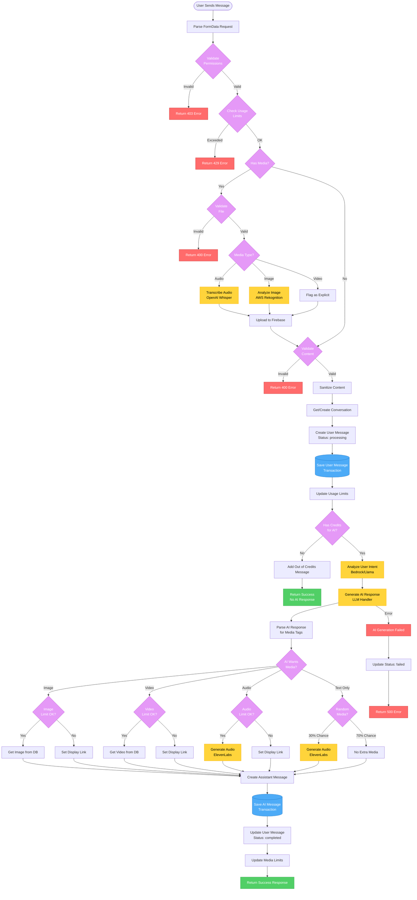

# Message Flow Diagram - Save Message V2

## Overview
This document illustrates the complete flow of message processing in the V2 save-message endpoint, from user input to AI response.

## Message Flow Diagram

## Flow Stages Explained

### 1. **Request Validation** (Steps 1-4)
- Parse FormData and extract parameters
- Validate user permissions (premium status, girl availability)
- Check usage limits (messages, images, audio)
- Validate file uploads if present

### 2. **Media Processing** (Steps 5-8)
- **Audio**: Transcribe using OpenAI Whisper
- **Image**: Analyze with AWS Rekognition for moderation
- **Video**: Auto-flag as explicit content
- Upload all media to Firebase Storage

### 3. **Message Preparation** (Steps 9-11)
- Validate message content
- Sanitize user input
- Get or create conversation document
- Create user message object with "processing" status

### 4. **Database Transaction 1** (Steps 12-14)
- Save user message to conversation
- Update usage limits
- Check if user has credits for AI response

### 5. **AI Response Generation** (Steps 15-17)
- Analyze user intent using Bedrock/Llama
- Generate AI response using LLM
- Parse response for media tags ([IMAGE:], [VIDEO:], [AUDIO:])

### 6. **Media Enrichment** (Steps 18-22)
- Check if AI requested media and user has credits
- Fetch appropriate media from database
- Generate audio if requested
- 30% chance of random audio for text-only responses

### 7. **Database Transaction 2** (Steps 23-25)
- Save AI response message
- Update user message status to "completed"
- Update media usage limits

### 8. **Error Handling**
- Each stage has specific error handling
- Failed AI generation updates message status to "failed"
- All errors return appropriate HTTP status codes

## Key Features

### Transaction Boundaries
- **Transaction 1**: Saves user message and updates limits atomically
- **Transaction 2**: Saves AI response and finalizes message status atomically

### Performance Optimizations
- Frontend sends cached user/girl data to reduce reads
- Media processing happens asynchronously where possible
- Early returns for out-of-credits scenarios

### Security Measures
- Permission validation at the start
- File validation before processing
- Content sanitization
- Rate limiting (not shown in diagram)